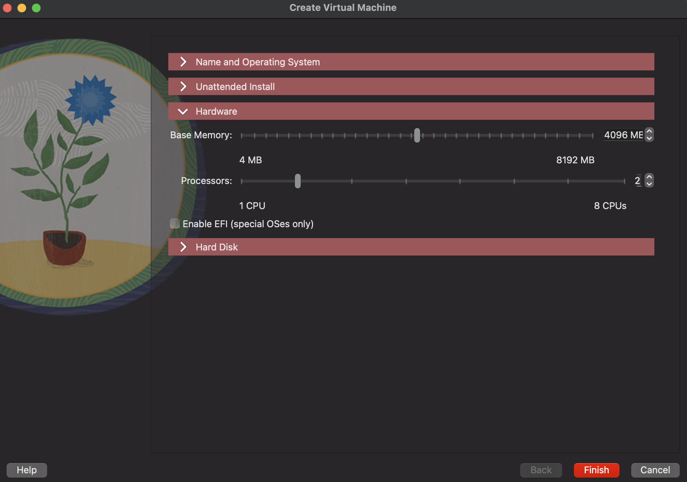
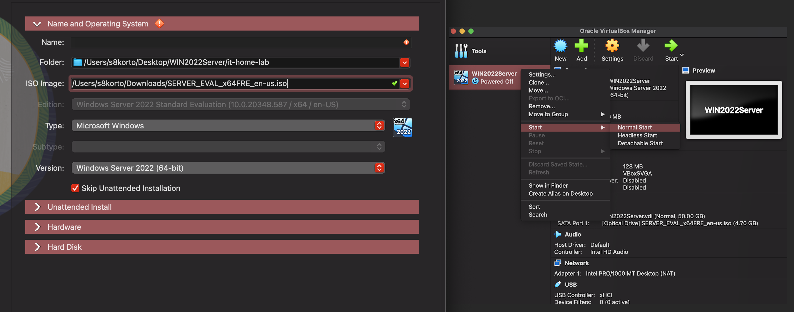
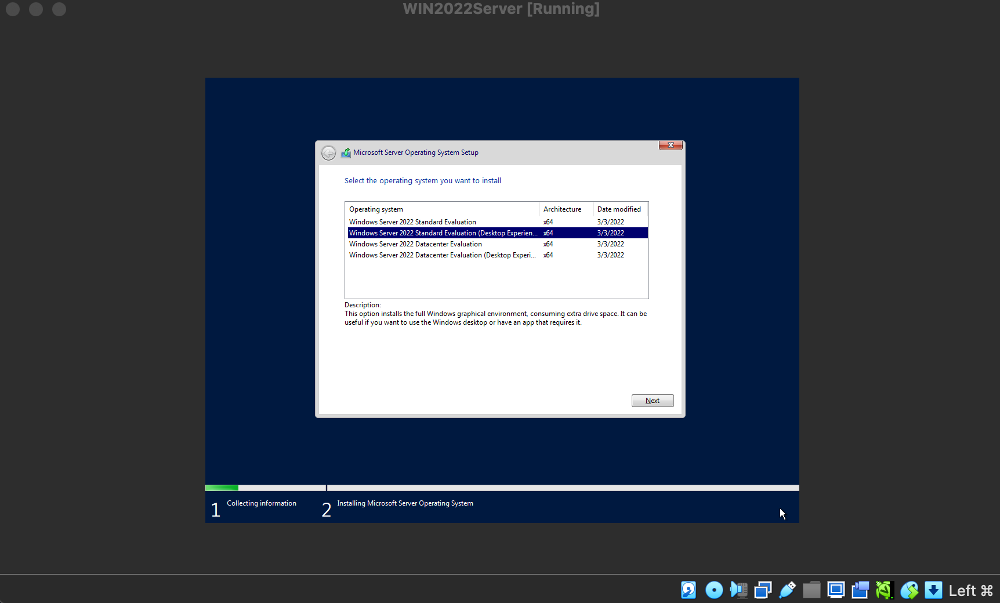
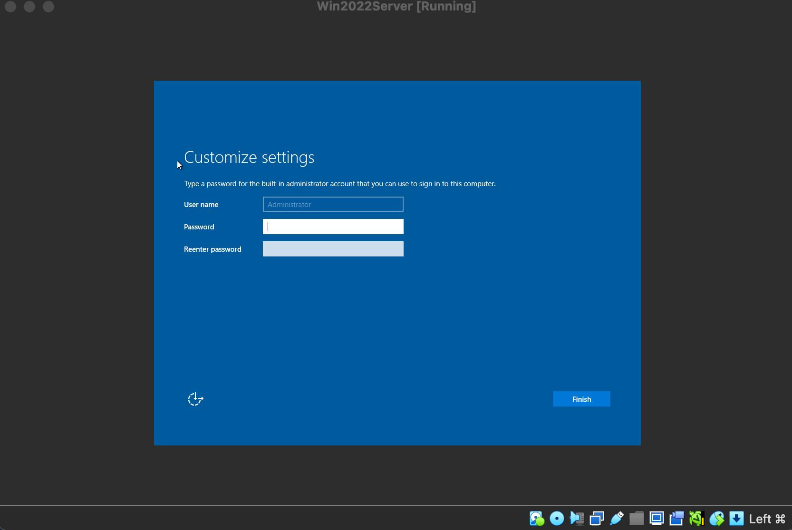
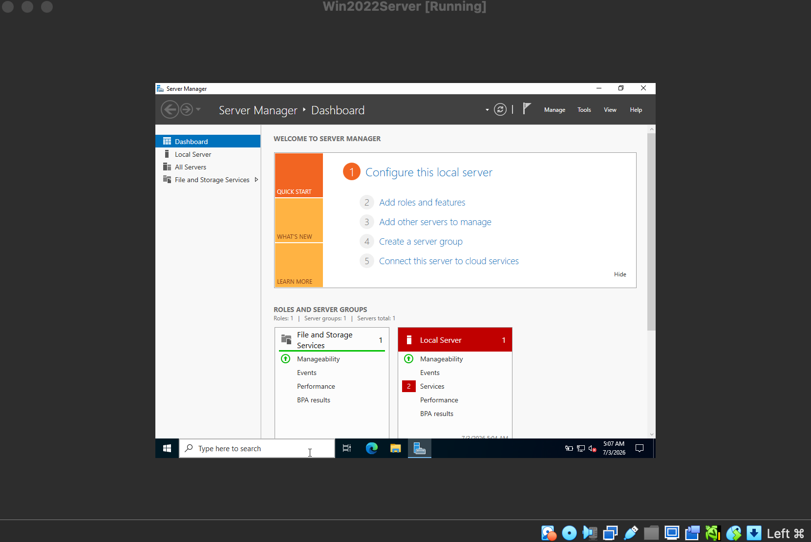
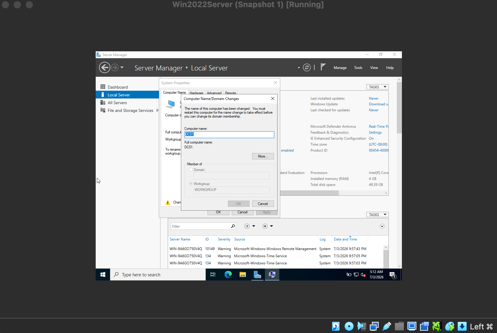
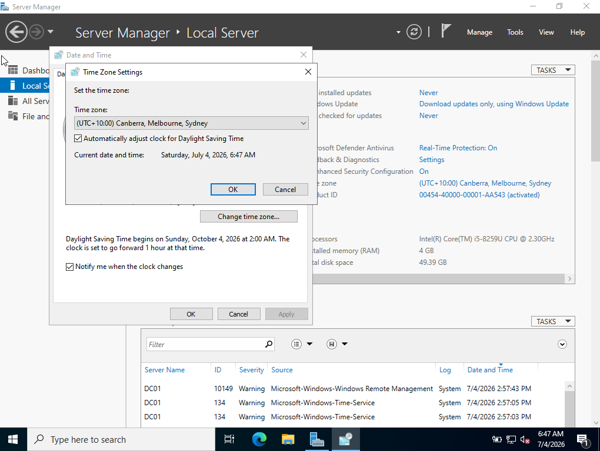
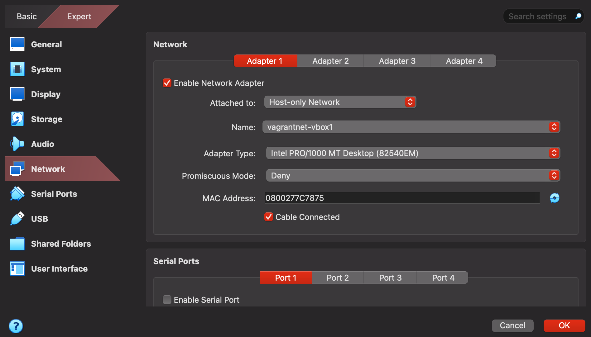
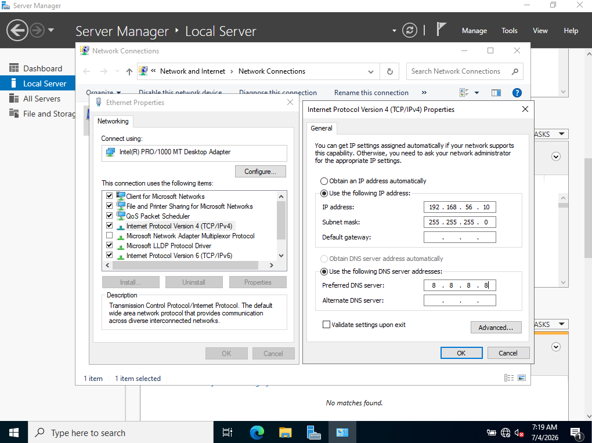
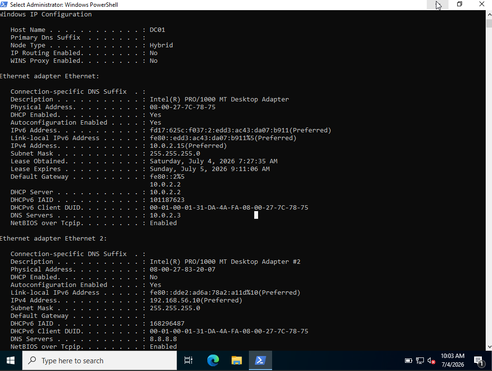

# Windows Server 2022 Installation

## Objective
Install Windows Server 2022 in a VirtualBox virtual machine and perform the initial configuration required to prepare the server for an Active Directory domain environment.

---

## Lab Environment

Host Operating System:
- macOS (Intel)

Hypervisor:
- VirtualBox 7.x

Guest Operating System:
- Windows Server 2022 Standard (Desktop Experience)

---

## Prerequisites

Before creating the virtual machine, I downloaded the following software:

| Software | Purpose |
|----------|---------|
| VirtualBox 7.x | Virtualization platform |
| Windows Server 2022 Evaluation ISO | Operating system installation media |

### Download Sources

- [VirtualBox Downloads](https://www.virtualbox.org/wiki/Downloads)
- [Windows Server 2022 Evaluation Center](https://www.microsoft.com/evalcenter)

---

## Virtual Machine Specifications

| Setting | Value |
|---------|------|
| Hypervisor | VirtualBox 7.x |
| Guest OS | Windows Server 2022 Standard (Desktop Experience) |
| Memory | 4096 MB |
| CPUs | 2 |
| Storage | 50 GB VDI |
| Network | NAT + Host-only Adapter |

---

## Installation Steps

### 1. Created Virtual Machine

Configured a new VirtualBox VM with 4 GB RAM, 2 CPUs and a 50 GB virtual hard disk.

**Reason**

These specifications provide sufficient resources for running Windows Server 2022 while supporting future Active Directory and client machine deployments in the lab environment.

---

### 2. Attached Windows Server ISO

Mounted the Windows Server 2022 ISO and booted the virtual machine.

---

### 3. Installed Windows Server

Selected Windows Server 2022 Standard (Desktop Experience) and completed the installation.

**Reason** 

Selected Desktop Experience because it provides a graphical interface, making it easier to learn Windows Server administration before transitioning to Server Core environments.

---

### 4. Initial Configuration

- Set Administrator password
- Logged into Windows

- Verified Server Manager launched successfully

---

### 5. Renamed Server

Renamed the computer to **DC01**. Restarted the server to apply the hostname change.

**Reason**

Renamed the server to DC01 to provide a meaningful hostname before promoting it to a Domain Controller. Using descriptive names simplifies server identification and administration.

---

### 6. Set Time Zone 

Configured the server's time zone to match the lab environment.

**Reason**

Configured the correct time zone to ensure accurate timestamps for system logs, authentication, scheduled tasks, and future Active Directory operations.

---

### 7. Configured VirtualBox Network Adapters

Configured the VirtualBox network adapters by enabling a NAT Adapter for internet connectivity and a Host-only Adapter for communication within the lab environment.

**Reason**

Configured the virtual machine to use a Host-only Adapter so the server could communicate with other virtual machines while remaining isolated from the external network. This configuration is ideal for Active Directory lab environments.

The virtual machine uses two network adapters:

- NAT Adapter for internet connectivity
- Host-only Adapter for communication with other virtual machines in the lab

---

### 8. Configured a Static IP Address

Configured a static IPv4 address for future Active Directory deployment.

- IP Address: 192.168.56.10
- Subnet Mask: 255.255.255.0
- Gateway: blank
- DNS Server: 8.8.8.8

For the initial installation, Google's public DNS (8.8.8.8) was used to provide internet name resolution. After installing Active Directory Domain Services, the preferred DNS server will be changed to the domain controller itself (192.168.56.10).

**Reason** 

Configured a static IPv4 address because Active Directory Domain Controllers require a fixed IP address. Dynamic IP addresses can cause DNS and authentication issues if the address changes.

---

## Validation

- ✔ Windows Server 2022 installed successfully
- ✔ Server Manager launches without errors
- ✔ Computer renamed to **DC01**
- ✔ Host-only network adapter configured
- ✔ Static IPv4 address (**192.168.56.10**) assigned
- ✔ DNS server configured
- ✔ Network configuration verified using `ipconfig /all`

The server has been successfully configured and is ready for Active Directory Domain Services (AD DS) installation.

---

## Skills Demonstrated

- VirtualBox virtual machine provisioning
- Windows Server 2022 installation
- Windows Server initial configuration
- Host-only networking
- Static IPv4 configuration
- Basic Windows Server administration

---

## Next Steps

The server is now prepared for the next stage of the lab environment:

- Install Active Directory Domain Services (AD DS)
- Promote the server to a Domain Controller
- Create a new forest
- Configure DNS
- Create Organizational Units
- Create users and groups
- Join Windows 10 clients to the domain

