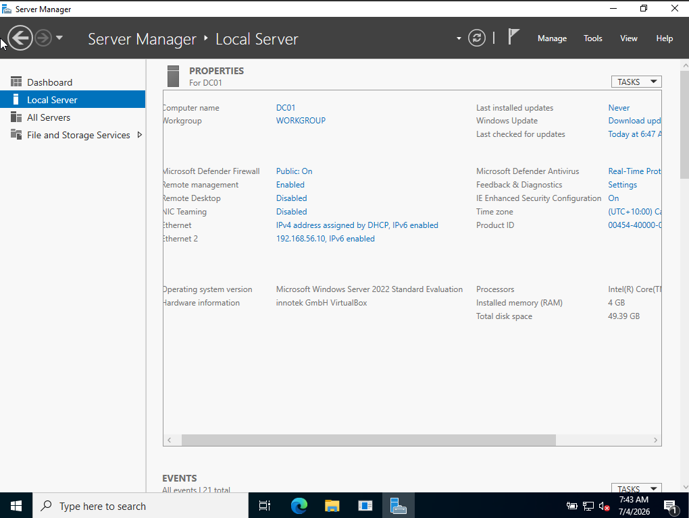

# Windows Server 2022 Installation

## Objective
Install Windows Server 2022 in a virtual machine and perform the initial configuration.

---

## Prerequisites

Before creating the virtual machine, I downloaded the following software:

| Software | Purpose |
|----------|---------|
| VirtualBox 7.x | Virtualization platform |
| Windows Server 2022 Evaluation ISO | Operating system installation media |

### Download Sources

- VirtualBox 7.x : https://www.virtualbox.org/wiki/Downloads
- Windows Server 2022 Evaluation: https://www.microsoft.com/evalcenter

---

## Virtual Machine Specifications

| Setting | Value |
|---------|------|
| Hypervisor | VirtualBox 7.x |
| Guest OS | Windows Server 2022 Standard (Desktop Experience) |
| Memory | 4096 MB |
| CPUs | 2 |
| Storage | 50 GB VDI |
| Network | Host-only Adapter |

---

## Installation Steps

### 1. Created Virtual Machine

Configured a new VirtualBox VM with 4 GB RAM, 2 CPUs and a 50 GB virtual hard disk.

---

### 2. Attached Windows Server ISO

Mounted the Windows Server 2022 ISO and booted the virtual machine.

---

### 3. Installed Windows Server

Selected Windows Server 2022 Standard (Desktop Experience) and completed the installation.

**why?** 

Selected Desktop Experience because it provides a graphical interface, making it easier to learn Windows Server administration before transitioning to Server Core environments.

---

### 4. Initial Configuration

- Set Administrator password
- Logged into Windows

- Verified Server Manager launched successfully

---

### 5. Renamed Server

Renamed the computer to **DC01**. Restarted the server to apply the hostname change.

**why?**

Renamed the server to DC01 to provide a meaningful hostname before promoting it to a Domain Controller. Using descriptive names simplifies server identification and administration.

---

### 6. Set Time Zone 

Configured the correct system time zone

---

### 7. Configured VirtualBox Network

Set VirtualBox Network to Host-only Network.

**why?**

Configured the virtual machine to use a Host-only Adapter so the server could communicate with other virtual machines while remaining isolated from the external network. This configuration is ideal for Active Directory lab environments.

---

### 8. Configured a Static IP Address

Configured a static IPv4 address for future Active Directory deployment.

- IP Address: 192.168.56.10
- Subnet Mask: 255.255.255.0
- Gateway: blank
- DNS Server: 8.8.8.8

Initially configured Google's public DNS (8.8.8.8) for internet name resolution. After installing Active Directory, the server will be reconfigured to use itself as the preferred DNS server.

**why?** 

Configured a static IPv4 address because Active Directory Domain Controllers require a fixed IP address. Dynamic IP addresses can cause DNS and authentication issues if the address changes.

---

## Validation

Verified the following:

✔ Windows Server installed successfully

✔ Administrator account accessible

✔ Server Manager launches without errors

✔ Computer renamed to DC01

✔ Static IP address applied correctly

✔ Network connectivity confirmed using ipconfig

---

## Skills Demonstrated

- Windows Server installation
- Virtual machine provisioning
- Initial server configuration
- Static IP networking
- Server administration

---

## Next Steps

The server is now prepared for the next stage of the lab environment:

- Install Active Directory Domain Services (AD DS)
- Promote the server to a Domain Controller
- Create a new forest
- Configure DNS
- Create Organizational Units
- Create users and groups
- Join Windows 10 clients to the domain

