# Active Directory 

## Overview 

In this section I installed Active Directory Domain Services (AD DS) and promoted the Windows Server to a Domain Controller

## Objective

Install Active Directory Domain Services (AD DS) on Windows Server 2022 and promote the server to a Domain Controller by creating a new Active Directory forest. Verify that Active Directory is functioning correctly and ready for managing users, computers, and domain resources.

---

## Lab Environment

**Host Operating System**
- macOS (Intel)

**Hypervisor**
- VirtualBox 7.x

**Guest Operating System**
- Windows Server 2022 Standard (Desktop Experience)

**Server Name**
- DC01

**Domain Name**
- homelab.local

**Network Configuration**
- IP Address: 192.168.56.10
- Subnet Mask: 255.255.255.0
- Default Gateway: (leave blank for Host-Only Network)
- Preferred DNS Server: 192.168.56.10 (configured after AD DS installation)

**Server Roles Installed**
- Active Directory Domain Services (AD DS)
- DNS Server

---

## Prerequisites

Before installing Active Directory Domain Services, ensure the following requirements have been completed:

- Windows Server 2022 has been successfully installed.
- The server has been assigned a static IP address.
- The server has been renamed (recommended: DC01).
- Initial server configuration has been completed.
- Administrator account is available for installation.
- The server is connected to the Host-Only network.
- Windows Server is fully booted and accessible through Server Manager.

---

## Installation Steps

### 1. Open the Add Roles and Features Wizard

Open the Add Roles and Features Wizard from Server Manager to begin installing the Active Directory Domain Services (AD DS) role. 

**Instructions**

1. Open Server Manager.
2. Click Manage in the upper-right corner.
3. Select Add Roles and Features.

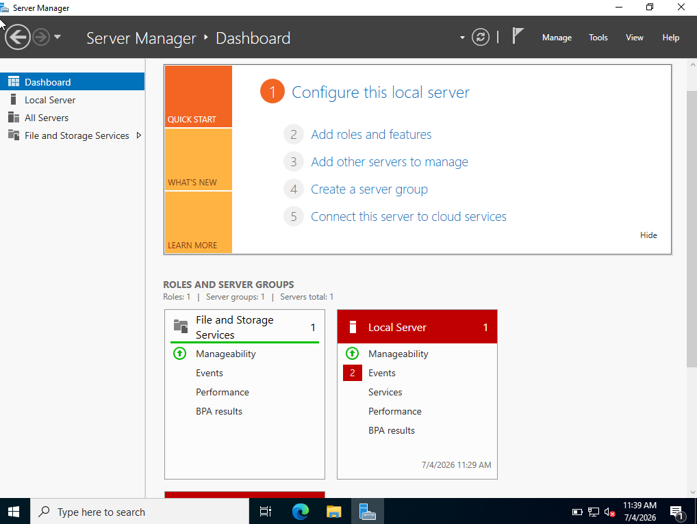

**why?**

The Add Roles and Features Wizard is used to install Windows Server roles and features. In this lab, it is used to install Active Directory Domain Services (AD DS), which is required before the server can be promoted to a Domain Controller.

---

### 2. Select the Installation Type 

Select Role-based or feature-based installation.

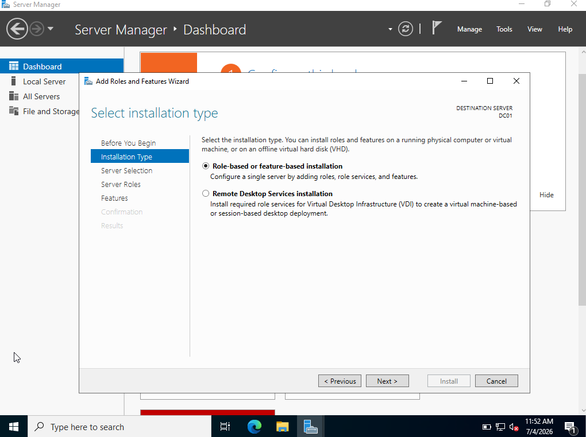

**why?** 

The Role-based or feature-based installation option is used when installing server roles and features on a Windows Server. It allows roles such as:

- Active Directory Domain Services (AD DS)
- DNS Server
- DHCP Server
- Web Server (IIS)

In this lab, it is used to install the Active Directory Domain Services (AD DS) role.

---

### 3. Select the Destination Server

Select the local server that will host the Active Directory Domain Services (AD DS) role, then click Next. 

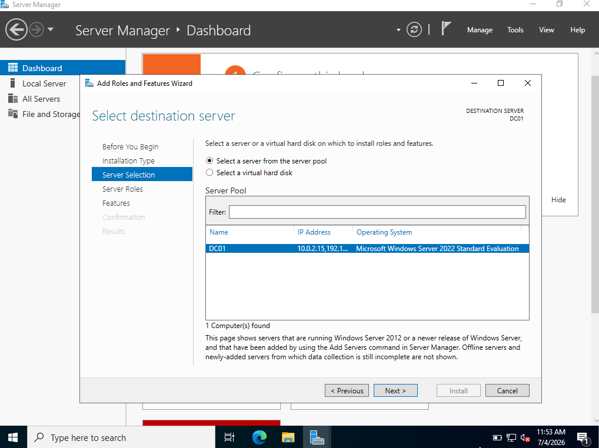

**why?**

The destination server specifies where the Active Directory Domain Services (AD DS) role will be installed. In this lab, the local Windows Server is selected because it will later be promoted to the Domain Controller for the network.

---

### 4. Select Server Roles

Select Active Directory Domain Services, then click Add Features when prompted.

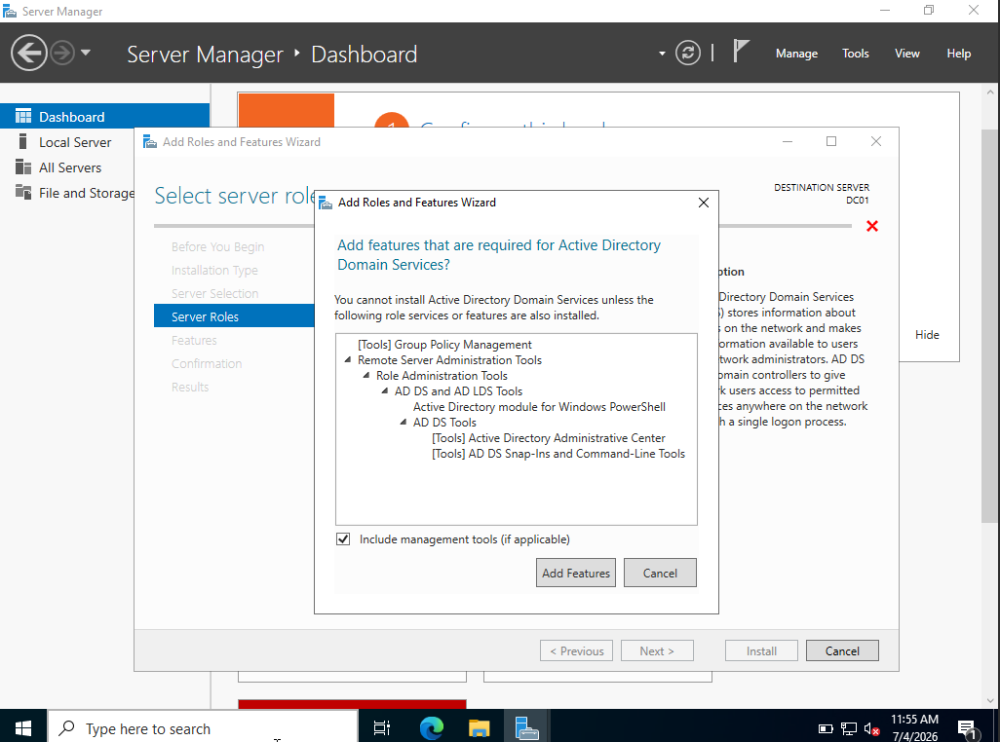

---

### 5. Install Active Directory Domain Services 

Begin the installation of the Active Directory Domain Services (AD DS) role.

**Instructions**

1. Review the installation summary.
2. Confirm that Active Directory Domain Services is listed.
3. Click Install.
4. Wait for the installation to complete.

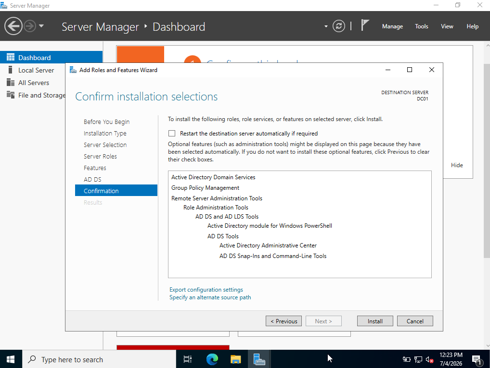

---

### 6. Promote Server to Domain Controller

After the Active Directory Domain Services role has been installed successfully, the server must be promoted to a Domain Controller to create and manage an Active Directory domain.

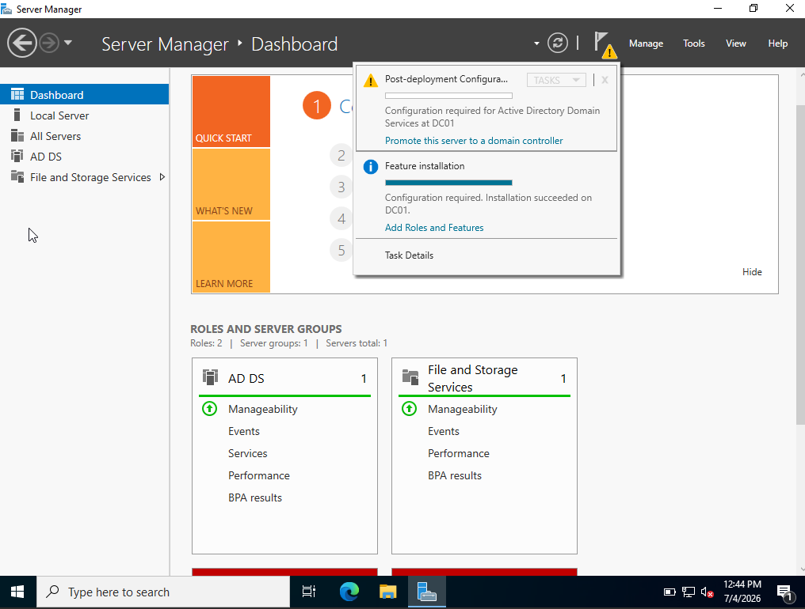

---

### 7. Deployment Configuration

Choose Add a new forest and Root domain: homelab.local.

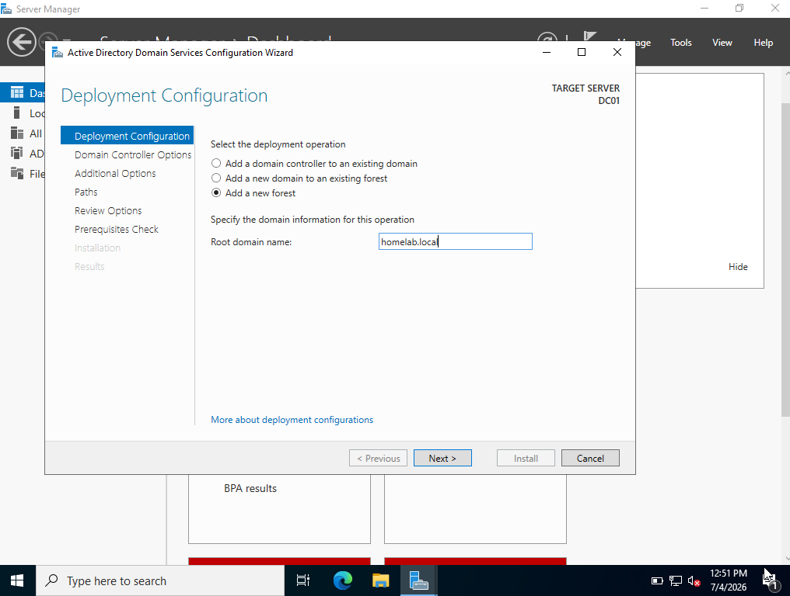

**why?**

A **forest** is the highest-level logical structure in Active Directory. It contains one or more domains and defines the security boundary for the entire Active Directory environment.

Because this is a new home lab with no existing Active Directory infrastructure, a **new forest** must be created. 

The root domain (`homelab.local`) becomes the first domain in the forest, allowing the server to manage users, computers, groups, and other Active Directory resources.

homelab.local is used as an internal domain name for this lab environment. It is intended only for private network use and provides a realistic Active Directory structure for learning and testing.

---

### 8. Domain Controller Options

Leave the default settings selected and create a **Directory Services Restore Mode (DSRM)** password.

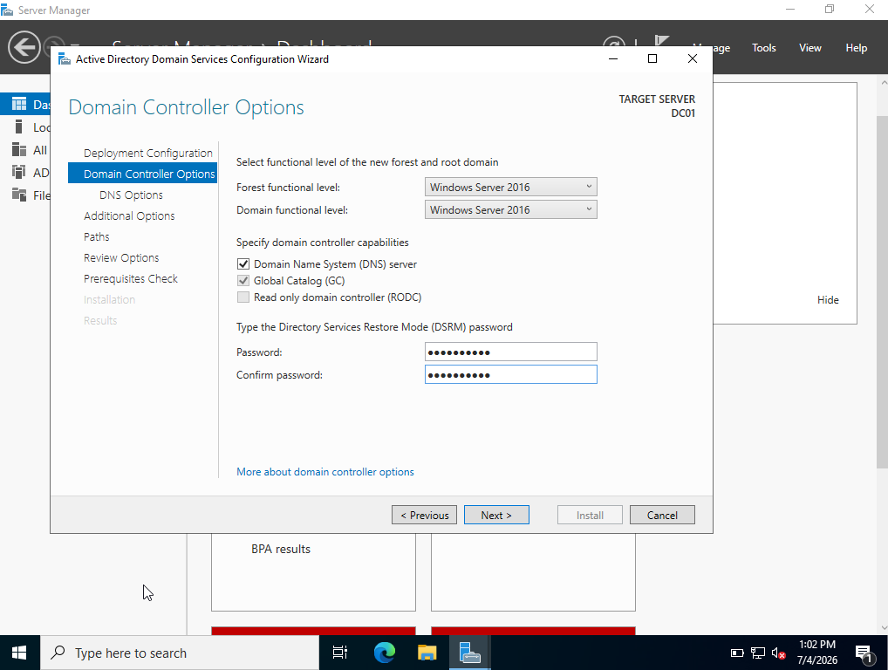

**why?**

The default settings are suitable for a new Active Directory environment:

- **DNS Server** – Installs the DNS Server role, which Active Directory uses to locate domain resources.
- **Global Catalog (GC)** – Stores a searchable copy of Active Directory objects, allowing users and computers to quickly locate resources across the domain.
- **Read Only Domain Controller (RODC)** – Leave this **unchecked** because this is the first writable domain controller in the domain.

Create a strong **Directory Services Restore Mode (DSRM)** password. This password is used to boot the domain controller into recovery mode for troubleshooting, restoring Active Directory, or performing maintenance tasks. It is separate from the domain administrator password and should be stored securely.

---

### 9. DNS Options

The wizard may display the following warning:

> **A delegation for this DNS server cannot be created because the authoritative parent zone cannot be found or does not run Windows DNS.**

This is expected in a home lab. Click **Next** to continue.

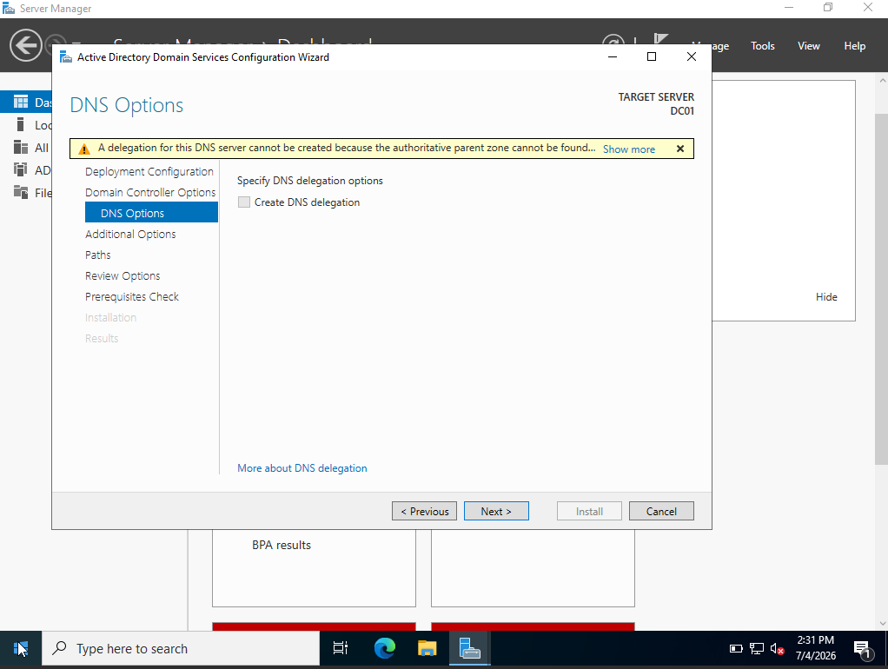

**why?**

This warning appears because there is **no existing parent DNS zone** to delegate the new domain to. In a home lab, you are creating the first Active Directory domain and DNS infrastructure from scratch, so there is no parent DNS server available.

The Active Directory Domain Services installation will automatically configure the DNS server for the new domain (`homelab.local`), allowing domain clients to locate domain controllers and other network resources.

---

### 10. Paths

Leave default location: 

- Database
- Logs
- SYSVOL

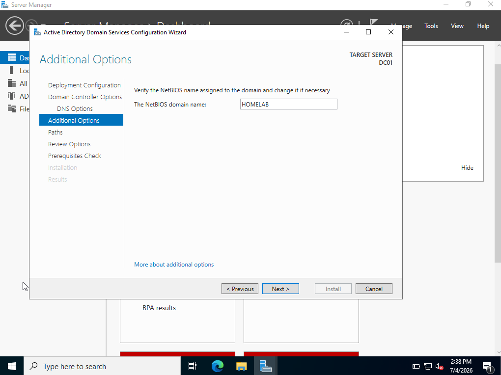

---

### 11. Prerequisite Check

The wizard performs a series of validation checks to ensure the server is ready to be promoted to a Domain Controller.

Review the results. If all prerequisite checks pass, click **Install**.

> **Note:** You may see warnings about DNS delegation. These are expected in a home lab environment and do not prevent the installation from continuing.

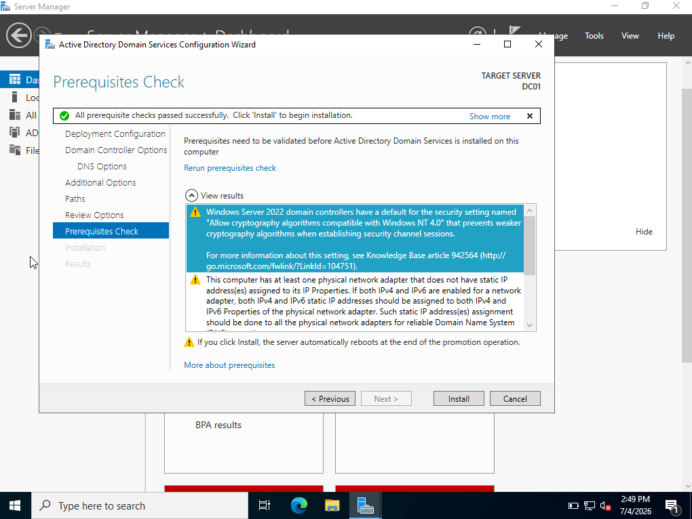

**why?**

Before promoting the server to a Domain Controller, Windows verifies that the required configuration is in place, including:

- Active Directory Domain Services is installed.
- Required DNS settings are configured.
- The domain name and NetBIOS name are valid.
- The server meets the requirements to host a new Active Directory forest.

If no critical errors are found, the server is ready to be promoted to a Domain Controller.

---

### 12. Automatic Restart

The server automatically restarts.

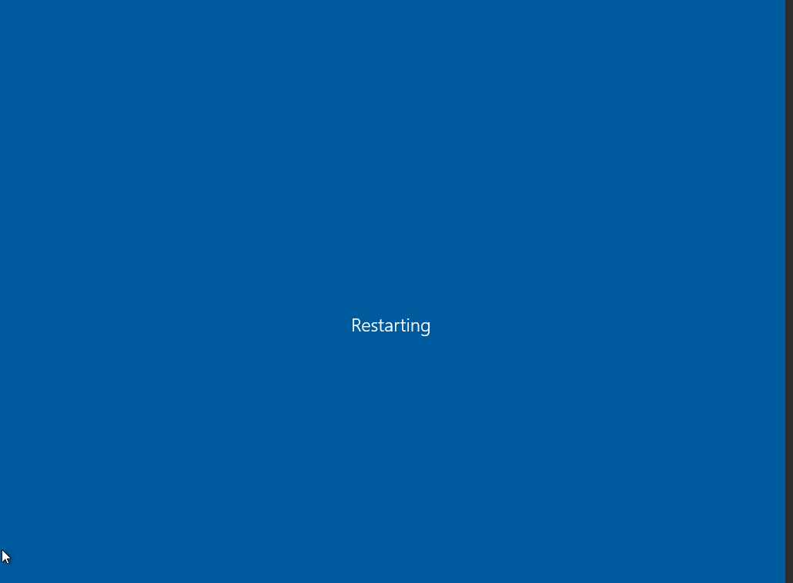

---

### 13. Sign In to the Domain

After the server restarts, sign in using one of the following accounts:

- `HOMELAB\Administrator`
- `Administrator@homelab.local`

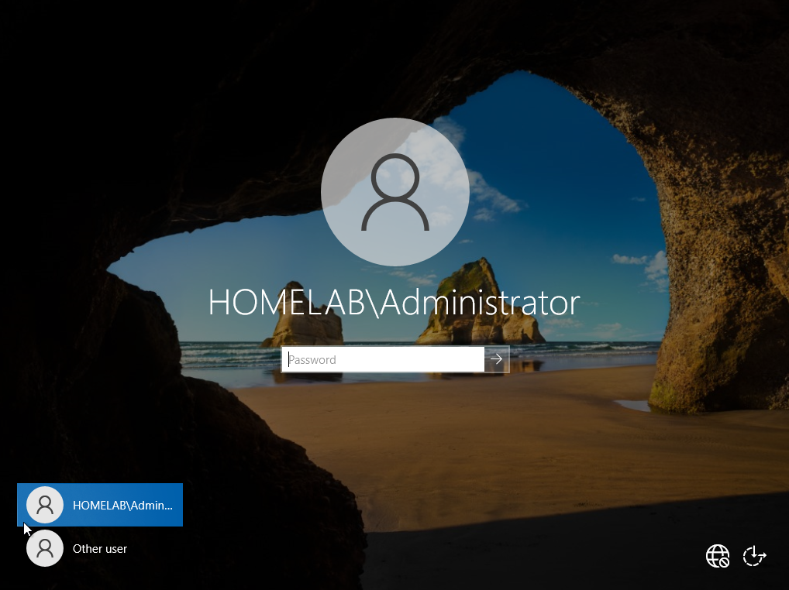

### Why?

After the server is promoted to a Domain Controller, the local Administrator account becomes the **domain Administrator** for the new Active Directory domain.

Successfully signing in confirms that:

- The server has been promoted to a Domain Controller.
- The `homelab.local` Active Directory domain has been created successfully.
- DNS and Active Directory services are functioning correctly.
- The server is ready for domain administration, including creating users, groups, organizational units (OUs), and joining client computers to the domain.

--- 

### 14. Verify Active Directory

Open **Server Manager** and navigate to:

**Tools** → **Active Directory Users and Computers**

Expand the **homelab.local** domain.

You should see the default Active Directory containers, including:

- **Builtin**
- **Computers**
- **Domain Controllers**
- **Users**

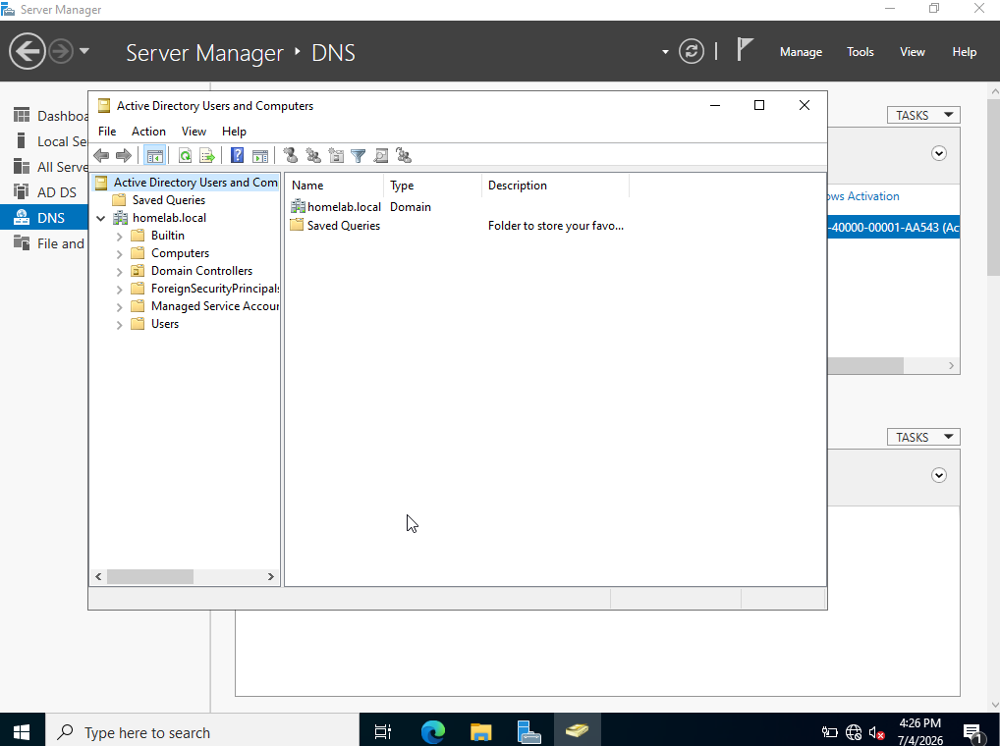

### Why?

Opening **Active Directory Users and Computers (ADUC)** verifies that the Active Directory domain was created successfully and that the server is functioning as a Domain Controller.

The default containers have the following purposes:

- **Builtin** – Contains built-in security groups used by Windows.
- **Computers** – Stores domain-joined computers that have not been moved into an Organizational Unit (OU).
- **Domain Controllers** – Contains all Domain Controllers in the domain.
- **Users** – Contains the default user and group accounts, including the **Administrator** account.

Seeing these default containers confirms that Active Directory has been installed and configured correctly, and the domain is ready for managing users, groups, Organizational Units (OUs), and Group Policy.

