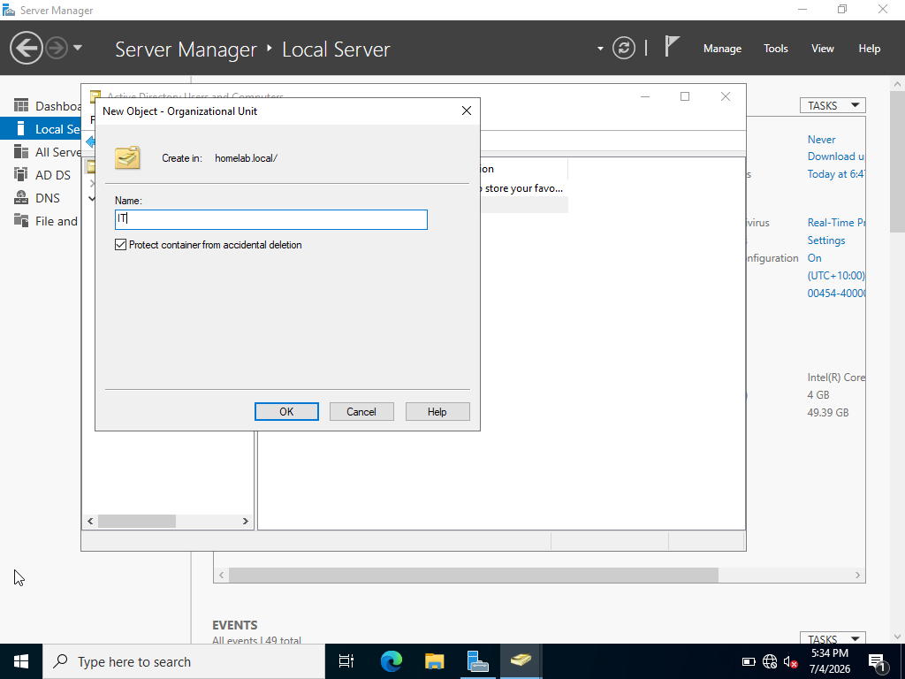
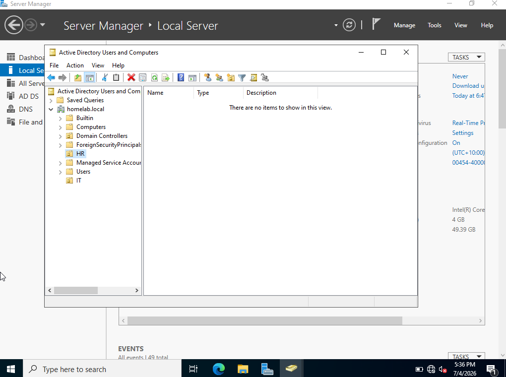
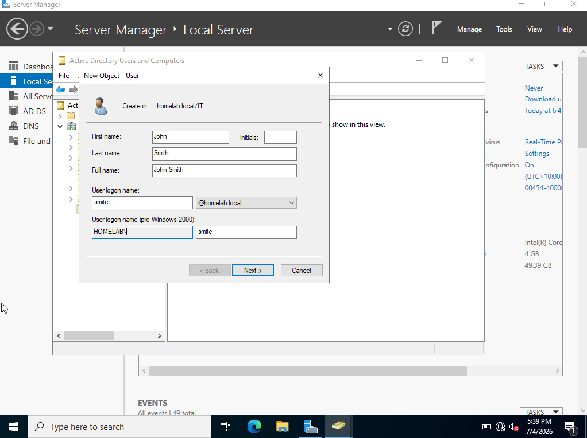
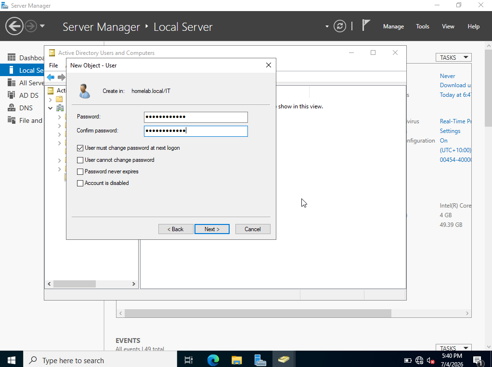
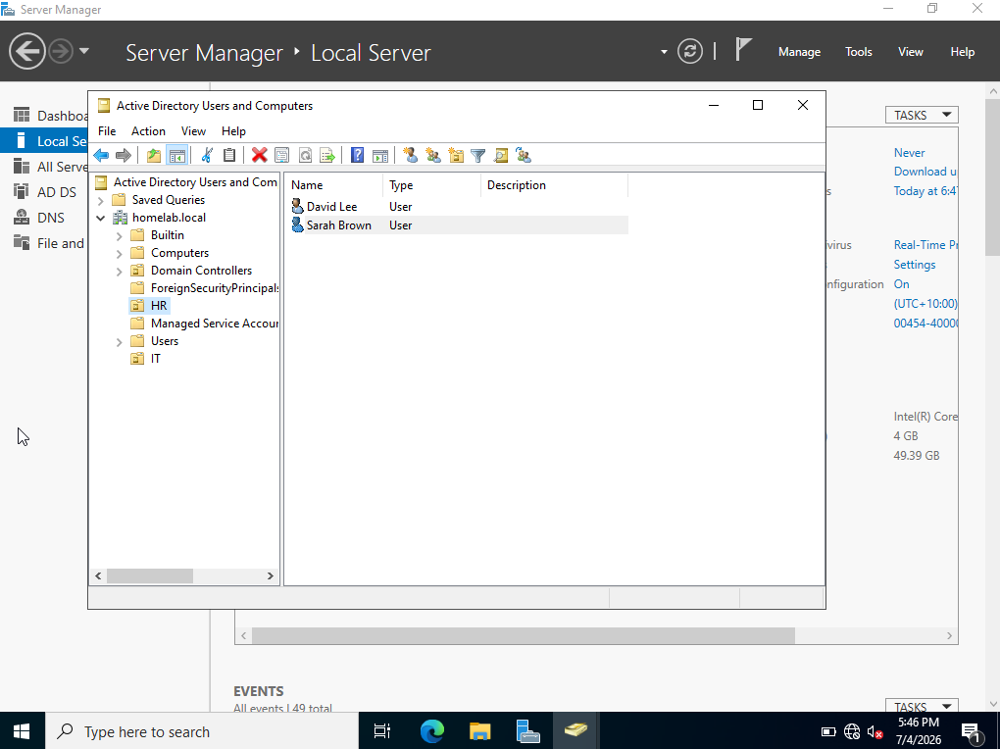
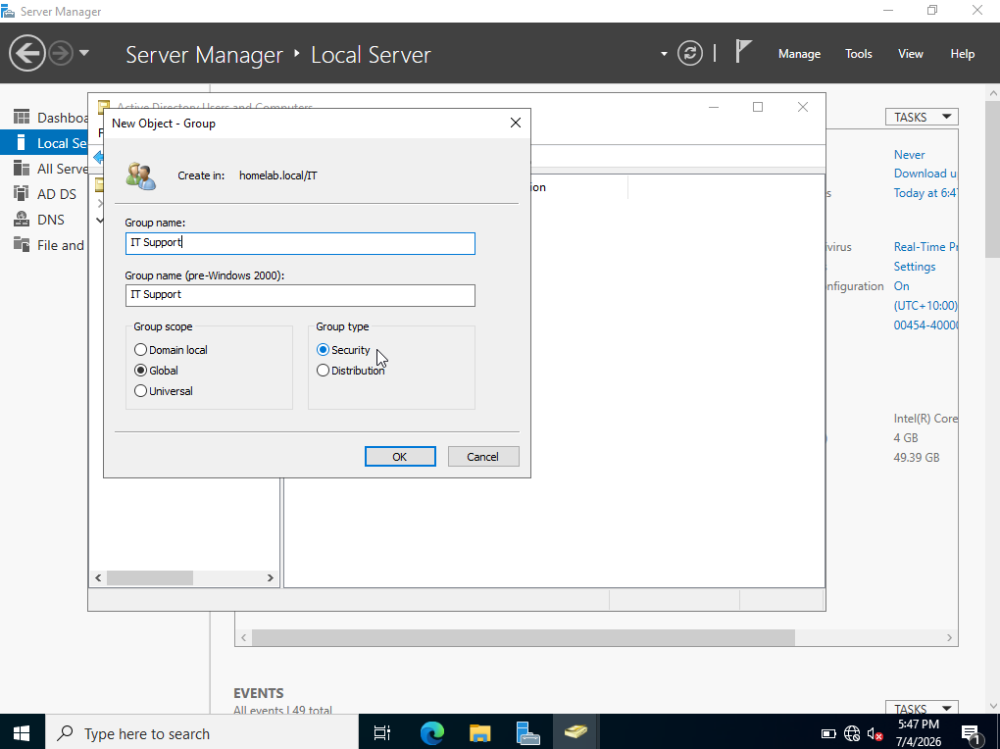
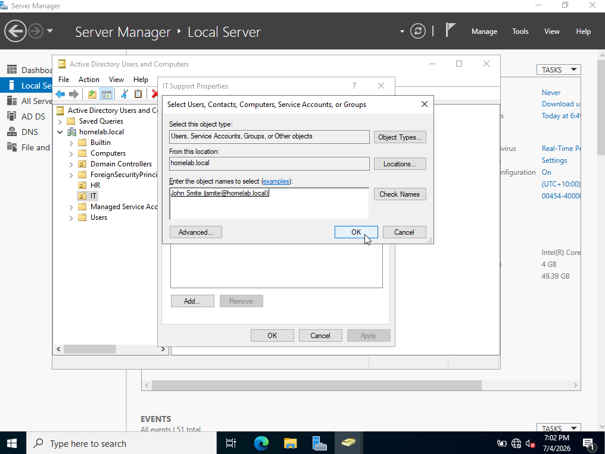
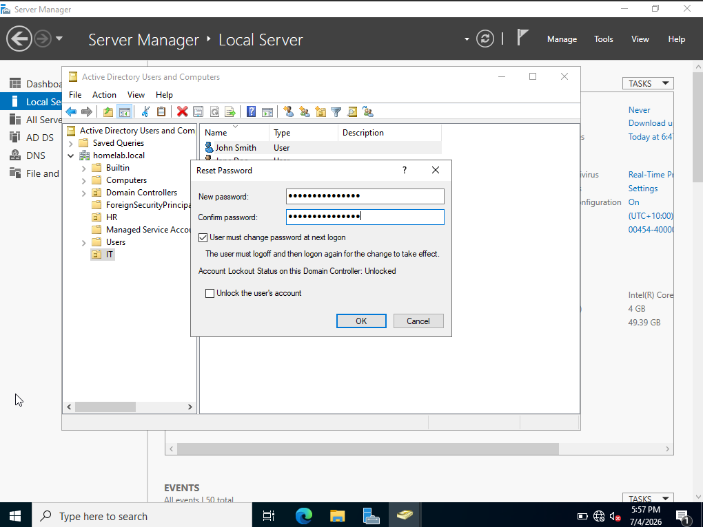
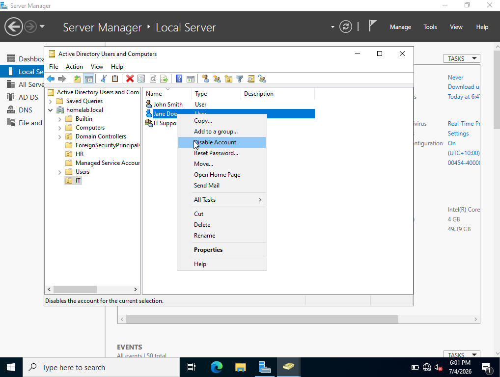
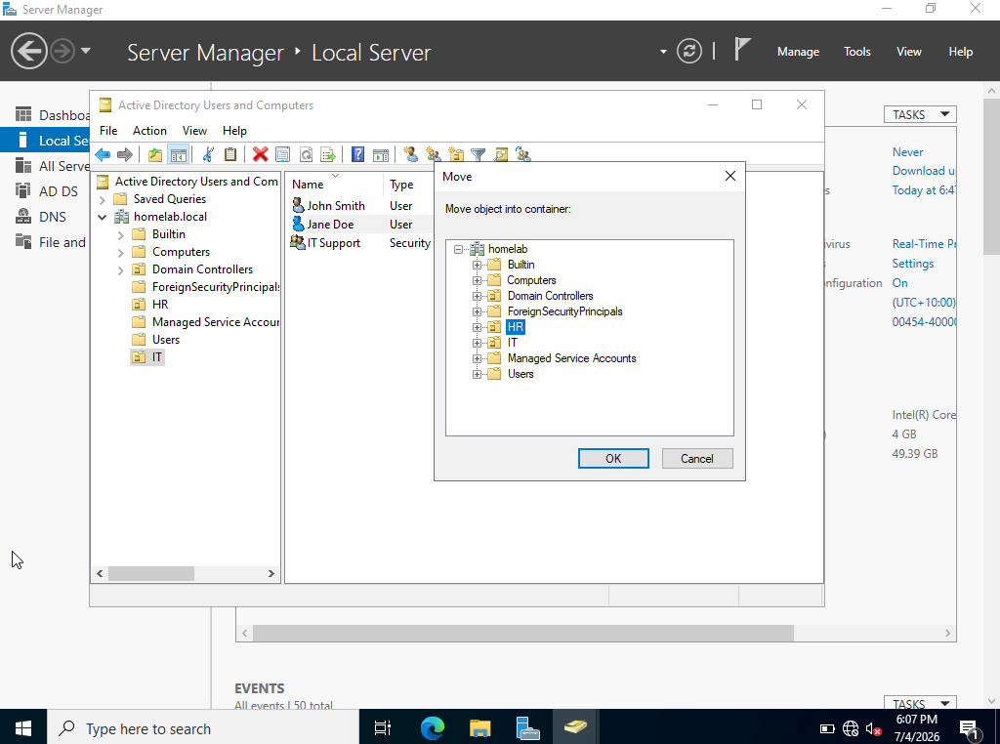

# User Management

## Objective

Create and manage Active Directory users, Organizational Units (OUs), and security groups in Windows Server 2022. Configure common account settings and organize directory objects using a structured Active Directory environment.

---

## Lab Environment

**Server**
- Windows Server 2022
- Active Directory Domain Services installed
- Domain Controller

**Tools**
- Active Directory Users and Computers (ADUC)

---

## Prerequisites

- Windows Server installed
- Active Directory configured
- Domain Controller running
- Administrator account

--- 

## Steps

### 1. Create an Organizational Unit (OU)

Instead of storing users in the default **Users** container, create an Organizational Unit (OU) to organize accounts by department or function.

1. Right-click your domain (e.g., **homelab.local**).
2. Select **New** → **Organizational Unit**.
3. Enter **IT** as the name.
4. Click **OK**.

**Key Idea**

Organizational Units (OUs) provide a logical way to organize Active Directory objects. They simplify administration, allow Group Policies to be applied to specific departments, and make user management easier than storing all accounts in the default Users container.

---

### 2. Create Another Organizational Unit (OU)

Create another Organizational Unit (OU) to represent a different department.

For this lab, create an OU named **HR** by repeating the same steps as before.

1. Right-click your domain (e.g., **homelab.local**).
2. Select **New** → **Organizational Unit**.
3. Enter **HR** as the name.
4. Click **OK**.

**Key Idea**

Creating separate OUs for different departments helps organize Active Directory objects and allows administrators to apply different Group Policy settings and permissions to each department independently.

---

### 3. Create a User Account

Create a new user account within the **IT** Organizational Unit (OU).

1. Right-click the **IT** OU.
2. Select **New** → **User**.
3. Enter the following information:
   - **First name:** John
   - **Last name:** Smith
   - **User logon name:** jsmith
4. Click **Next**.

---

### 4. Configure the User Password

1. Enter a password for the new user.
2. Leave **User must change password at next logon** unchecked.
3. Click **Next**, then **Finish**.

---

### 5. Create Additional User Accounts

Create a few more user accounts to simulate a small Active Directory environment.

Create the following users:

| First Name | Last Name | Username | OU |
|------------|-----------|----------|----|
| Jane | Doe | jdoe | IT |
| David | Lee | dlee | HR |
| Sarah | Brown | sbrown | HR |
| John | Smite | jsmite | IT |

Create each user by repeating the same steps as before and placing them in the appropriate Organizational Unit (OU).

---

### 6. Create a Security Group

Create a security group to manage permissions for users in the IT department.

1. Right-click the **IT** OU.
2. Select **New** → **Group**.
3. Enter the following settings:
   - **Group name:** IT Support
   - **Group scope:** Global
   - **Group type:** Security
4. Click **OK**.

---

### 7. Add Users to the Security Group

Add users to the **IT Support** security group to simplify permission management.

1. Right-click the **IT Support** group and select **Properties**.
2. Open the **Members** tab.
3. Click **Add**.
4. Enter the usernames of the IT users (e.g., **jsmith** and **jdoe**).
5. Click **Check Names**, then **OK**.
6. Click **Apply**, then **OK**.

---

### 8. Reset a User Password

Reset the password for an existing user account.

1. Right-click a user account (e.g., **John Smith**).
2. Select **Reset Password**.
3. Enter a new password (e.g., **NewPassword123!**).
4. Click **OK**.

**Key Idea**

Active Directory allows administrators to securely reset passwords and restore user access without recreating the account.

---

### 9. Disable a User Account

Disable a user account to prevent the user from signing in while keeping the account and its data intact.

1. Right-click **Jane Doe**.
2. Select **Disable Account**.
3. Click **OK** if prompted.

After disabling the account, a small down-arrow icon will appear on the user account, indicating that it is disabled.

**Key Idea**

It prevents sign-in without deleting the account, allowing administrators to restore access later if needed.

---

### 10. Move a User Between Organizational Units (OUs)

Move a user account to a different Organizational Unit (OU) to reflect changes in department or organizational structure.

1. Right-click **Jane Doe**.
2. Select **Move**.
3. Choose the **HR** OU.
4. Click **OK**.

**Key Idea**

Moving a user between OUs changes where the account is managed in Active Directory. This allows administrators to organize users by department and apply different Group Policy settings without affecting the user's account or group memberships.

