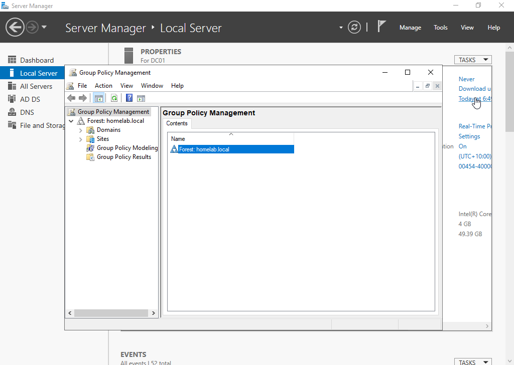
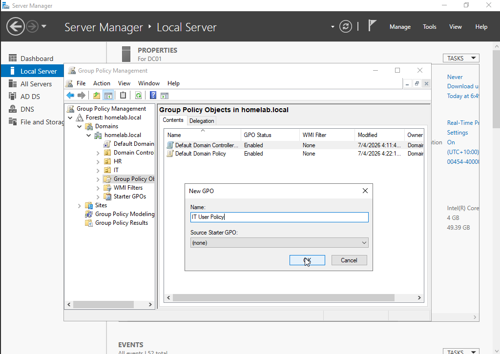
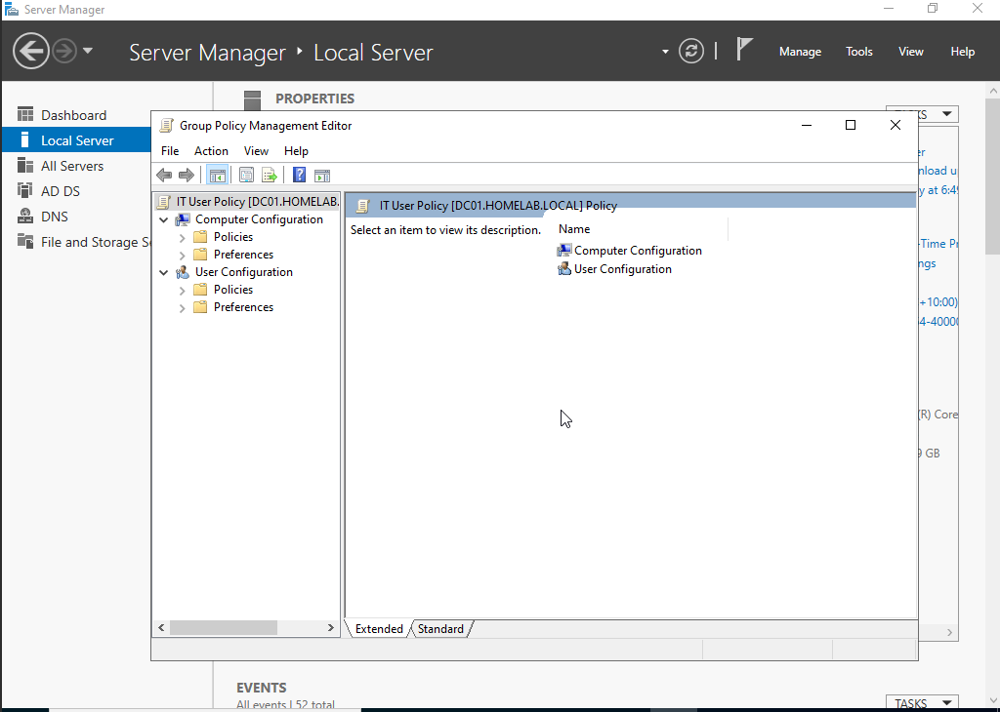
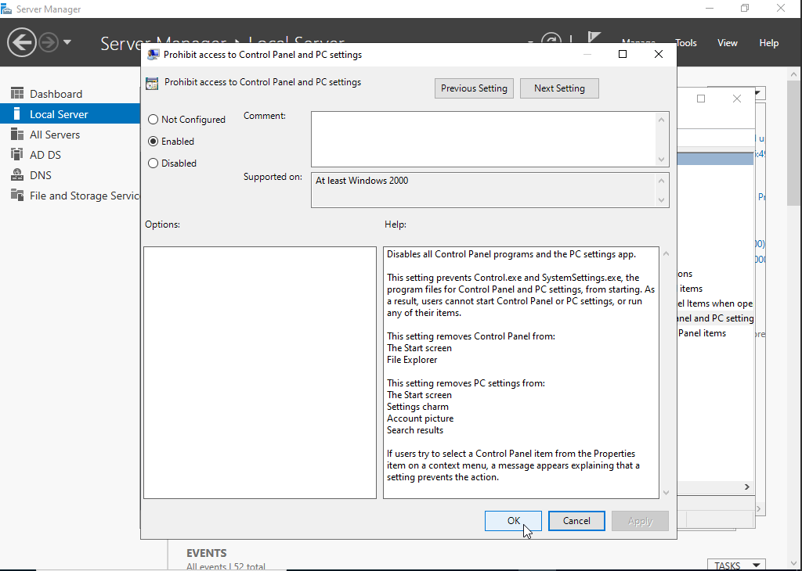
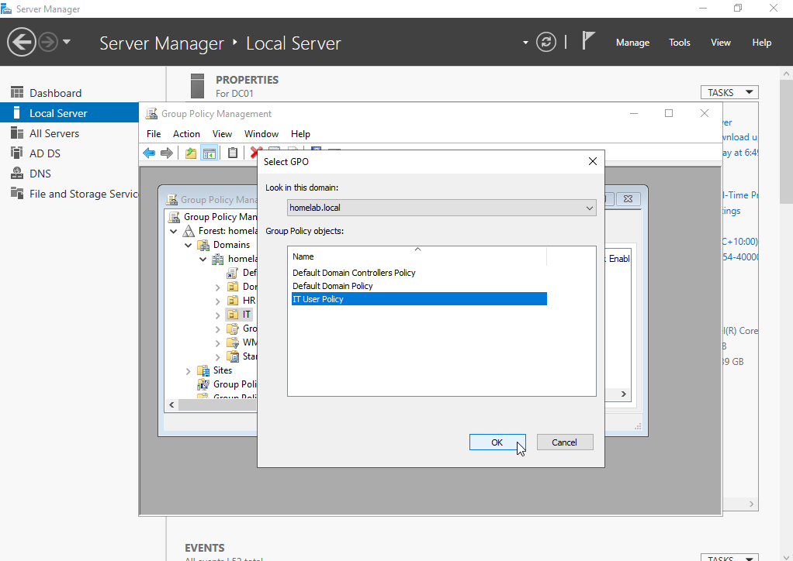
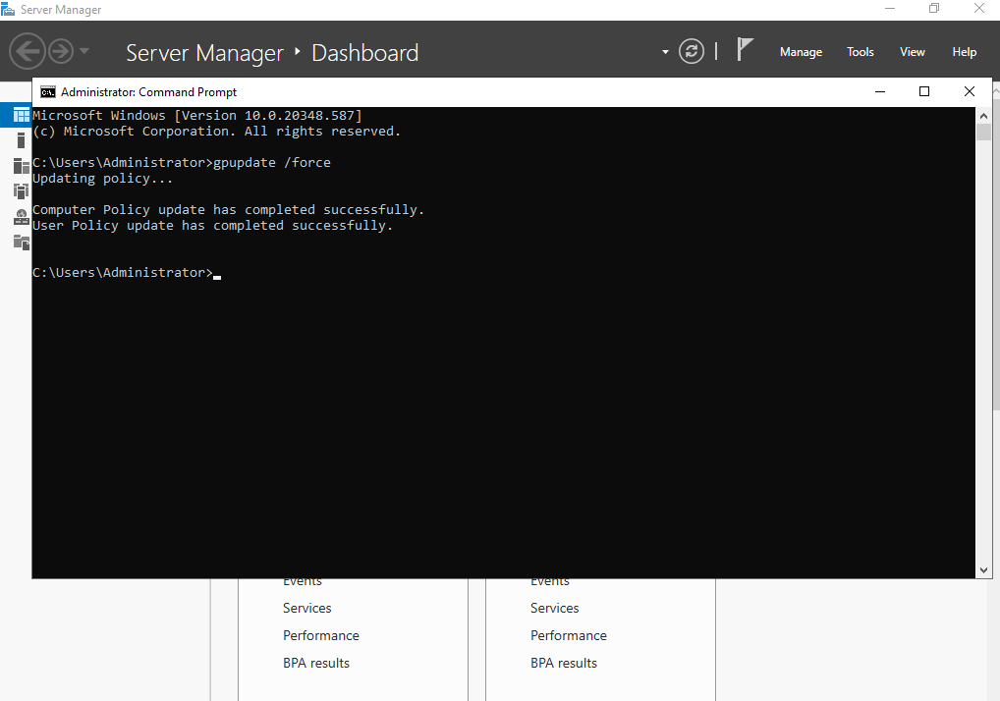
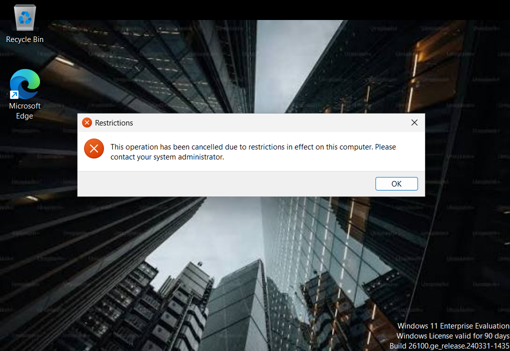
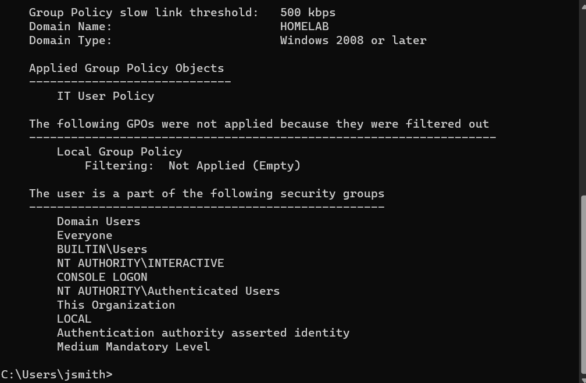

# Group Policy

## Objective

Configure and test Group Policy Objects (GPOs) in a Windows Server 2022 Active Directory environment to centrally manage user and computer settings across domain-joined devices.

---

## Lab Environment

**Domain Controller**
- Windows Server 2022
- Active Directory Domain Services
- Domain: homelab.local

**Client**
- Windows 11
- Joined to the homelab.local domain

---

## Prerequisites

Before starting, ensure the following are configured:

- Windows Server 2022 is installed and running.
- The server has been promoted to a Domain Controller with Active Directory Domain Services (AD DS).
- A Windows 11 client is joined to the Active Directory domain.
- A test user account exists for validating user policies.
- A test Organizational Unit (OU) exists for linking Group Policy Objects.

---

## Steps

### 1. Open Group Policy Management

Group Policy is managed through the **Group Policy Management Console** on the Domain Controller.

1. Open **Server Manager**.
2. Select **Tools** → **Group Policy Management**.
3. Expand **Forest** → **Domains** → **homelab.local**.



---

### 2. Create a Group Policy Object (GPO)

Create a new Group Policy Object (GPO) that will contain the settings you want to apply to users.

1. Expand **Forest** → **Domains** → **homelab.local**.
2. Right-click **Group Policy Objects**.
3. Select **New**.
4. Enter **IT User Policy** as the name.
5. Click **OK**.



---

### 3. Edit the Group Policy Object (GPO)

Open the Group Policy Management Editor to configure the settings that will be applied through the Group Policy Object (GPO).

1. Right-click **IT User Policy**.
2. Select **Edit**.
3. The **Group Policy Management Editor** opens.



---

### 4. Prevent Access to Control Panel

Configure a Group Policy setting to prevent users from accessing **Control Panel** and **PC Settings**.

1. Navigate to **User Configuration** → **Administrative Templates** → **Control Panel**.
2. Double-click **Prohibit access to Control Panel and PC settings**.
3. Select **Enabled**.
4. Click **Apply**.
5. Click **OK**.



---

### 5. Configure a Desktop Wallpaper

Configure a Group Policy setting to apply a standard desktop wallpaper to all users.

1. Navigate to **User Configuration** → **Administrative Templates** → **Desktop** → **Desktop**.
2. Double-click **Desktop Wallpaper**.
3. Select **Enabled**.
4. Enter the network path to the wallpaper image (for example, `\\Server\Wallpaper\company.jpg`).
5. Click **Apply**.
6. Click **OK**.

---

### 6. Link the Group Policy Object (GPO)

Link the Group Policy Object (GPO) to the **IT** Organizational Unit (OU) so the policy is applied to users within that OU.

1. Return to **Group Policy Management**.
2. Expand your domain and locate the **IT** Organizational Unit (OU).
3. Right-click **IT**.
4. Select **Link an Existing GPO**.
5. Choose **IT User Policy**.
6. Click **OK**.



**Key Idea**

A Group Policy Object (GPO) has no effect until it is linked to a site, domain, or Organizational Unit (OU). Linking the GPO to the **IT** OU ensures that only users and computers within that OU receive the configured policy settings, allowing administrators to target policies to specific departments or groups.

---

### 7. Verify the Group Policy Link

Confirm that the Group Policy Object (GPO) is successfully linked to the **IT** Organizational Unit (OU).

1. In **Group Policy Management**, select the **IT** Organizational Unit (OU).
2. Verify that **IT User Policy** appears under **Linked Group Policy Objects**.


---

### 8. Sign In to the Windows 11 Client

Sign in to the domain-joined Windows 11 client using the test domain user account.

1. Start the Windows 11 client.
2. At the sign-in screen, select **Other user** (if required).
3. Sign in using your domain user account (for example, **jsmith**).


**why**

Signing in with a domain user account allows Windows to retrieve and apply any Group Policy settings assigned to that user. This ensures the user receives the centrally managed configurations defined by the linked Group Policy Object (GPO).

---

### 9. Refresh Group Policy

Force the Windows 11 client to retrieve and apply the latest Group Policy settings from the Domain Controller.

1. Open **Command Prompt** as **Administrator**.
2. Run the following command:

   ```cmd
   gpupdate /force
   ```

3. Wait for the update to complete successfully.



**why**

The `gpupdate /force` command immediately refreshes both **User** and **Computer** Group Policy settings without waiting for the automatic refresh interval. This is commonly used by administrators to test new policies and verify that changes have been applied successfully.

---

### 10. Verify the Group Policy

Test that the Group Policy settings have been successfully applied to the Windows 11 client.

1. Press **Windows + R** to open the **Run** dialog.
2. Type the following command:

   ```text
   control
   ```

3. Press **Enter**.
4. Verify that a message appears indicating that **Control Panel has been restricted by your administrator**.



**Why**

Verifying the policy confirms that the Group Policy Object (GPO) has been successfully applied to the domain user. This demonstrates that the GPO is correctly configured, linked to the appropriate Organizational Unit (OU), and enforced on the Windows 11 client.

---

### 11. Verify Applied Group Policies

Confirm that the **IT User Policy** Group Policy Object (GPO) has been successfully applied to the domain user.

1. Open **Command Prompt**.
2. Run the following command:

   ```cmd
   gpresult /r
   ```

3. Review the output and verify that **IT User Policy** appears under **Applied Group Policy Objects**.



**Why**

The `gpresult /r` command displays the Resultant Set of Policy (RSoP) for the current user and computer. It allows administrators to verify which Group Policy Objects (GPOs) have been applied, making it an essential tool for troubleshooting and confirming successful Group Policy deployment.

---

## Summary

In this lab, I successfully created and deployed a Group Policy Object (GPO) in an Active Directory environment. I configured user policies, linked the GPO to an Organizational Unit (OU), applied the policy to a domain-joined Windows 11 client, and verified that the settings were successfully enforced.


