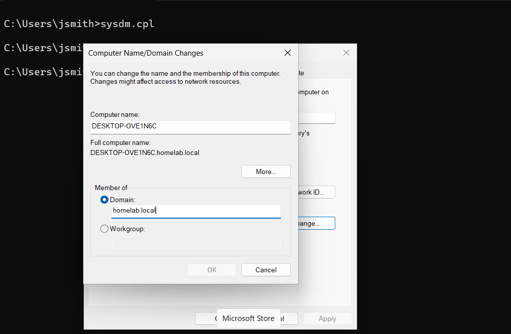
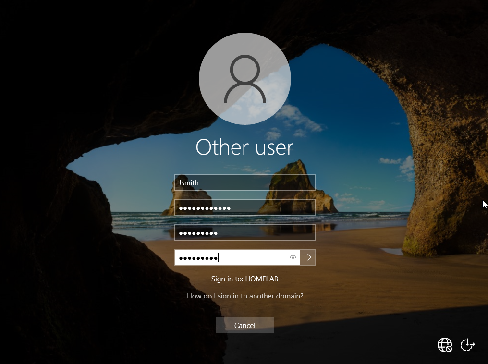
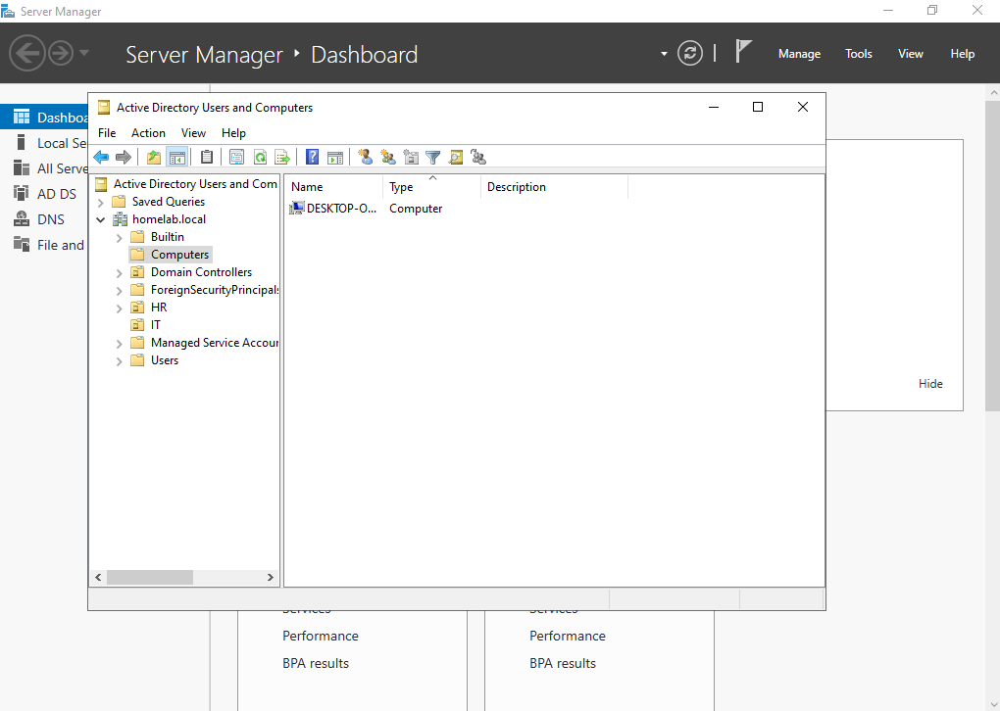

# Domain Join

## Objective

Join a Windows client to an Active Directory domain, allowing it to become part of the domain environment, authenticate using domain user accounts, receive Group Policy settings, and be centrally managed by the Domain Controller.

---

## Prerequisites

Before starting, ensure:

- Windows Server 2022 is installed and running
- Active Directory Domain Services (AD DS) is installed
- A domain has been created (homelab.local)
- DNS is configured on the Domain Controller
- A Windows 11 client virtual machine is installed
- The client and server are connected to the same network
- Network connectivity between the client and server is verified (e.g., ping test)
- A domain user account exists for testing
- Administrator credentials are available

---

## Steps

### 1. Verify Network Connectivity

On the Windows 11 client VM:

Open **Command Prompt**

Run:

```powershell
ping 192.168.56.10
```

**Expected output**

```text
Reply from 192.168.56.10
```
If you receive replies from the server, the client can communicate with the Domain Controller over the network.


**Why?**

Before joining a computer to a domain, it must be able to reach the Domain Controller. If the ping fails, the domain join process will also fail because the client cannot contact Active Directory services.

---

### 2. Verify DNS Resolution

On the Windows 11 client VM:

Open **Command Prompt**

Run:

```powershell
nslookup homelab.local
```

**Expected output**

```text
Server:  Unknown
Address: 192.168.56.10

Name:    homelab.local
Addresses:
          192.168.56.10
```


**Why?**

The client must be able to resolve the domain name to the Domain Controller's IP address. Active Directory relies on DNS to locate domain services during the domain join process.

---

### 3. Open System Properties

On the Windows 11 client VM:

Open **Command Prompt**

Run:

```powershell
sysdm.cpl
```

Press **Enter**.


**Why?**

The **System Properties** window allows you to change the computer's membership from a workgroup to an Active Directory domain.

---

### 4. Enter the Domain Name

In the **Computer Name/Domain Changes** window:

Select:

**Domain**

Enter your domain name:

```text
homelab.local
```

Click **OK**.



**Why?**

This tells Windows which Active Directory domain the computer should join. The client will use DNS to locate the Domain Controller and request permission to become a member of the domain.

---

## 5. Enter Domain Administrator Credentials

When prompted, enter the credentials of a domain account with permission to join computers to the domain.

**Username**

```text
Administrator
```

**Password**

Enter the password for the domain administrator account.

Click **OK**.

**Why?**

Windows requires authorization from the Domain Controller before a computer can join the domain. The administrator credentials verify that you have permission to add the computer to Active Directory.

---

## 6. Restart the Computer

After the credentials are verified, you will receive a confirmation message similar to:

```text
Welcome to the homelab.local domain.
```

Click **OK**.

You will then be prompted to restart the computer.

Click **OK**, then select:

**Restart Now**

**Why?**

Restarting the computer completes the domain join process. During startup, Windows applies the new domain membership and prepares the computer to authenticate with the Domain Controller.

---

## 7. Sign In with a Domain Account

After the computer restarts:

At the sign-in screen, select:

**Other user**

Sign in using a domain account.

Example:

```text
HOMELAB\jsmith
```

or

```text
jsmith@homelab.local
```

Enter the password for the domain user.

Click **Sign in**.



**Why?**

Signing in with a domain account verifies that the computer has successfully joined the Active Directory domain and can authenticate users through the Domain Controller.

---

## 8. Verify the Computer Object in Active Directory

On the Domain Controller:

Open **Active Directory Users and Computers**.

Expand:

```text
homelab.local
```

Select the **Computers** container.

Verify that your Windows client computer appears in the list.



**Why?**

When a computer successfully joins the domain, Active Directory automatically creates a computer object. Seeing the computer listed in the **Computers** container confirms that the Domain Controller has registered the client as a member of the domain.

---

## 9. Verify the Logged-in User

On the Windows 11 client VM:

Open **Command Prompt**.

Run:

```powershell
whoami
```

**Expected output**

```text
homelab\jsmith
```


**Why?**

The `whoami` command displays the account currently logged into Windows. If the output shows your domain name (for example, `homelab\jsmith`), it confirms that the user has successfully authenticated through Active Directory instead of using a local account.


