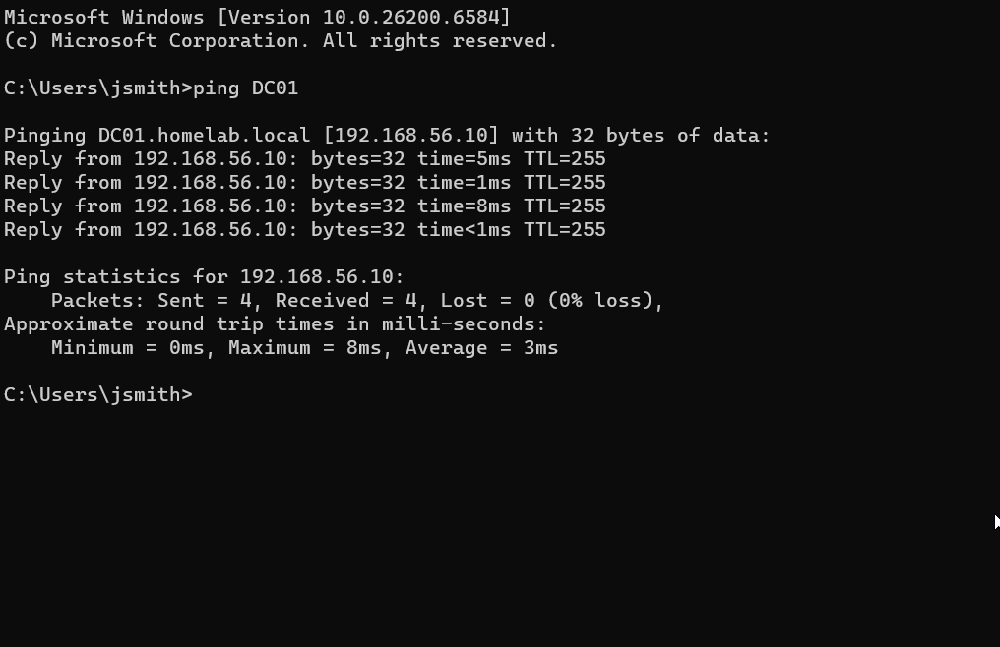
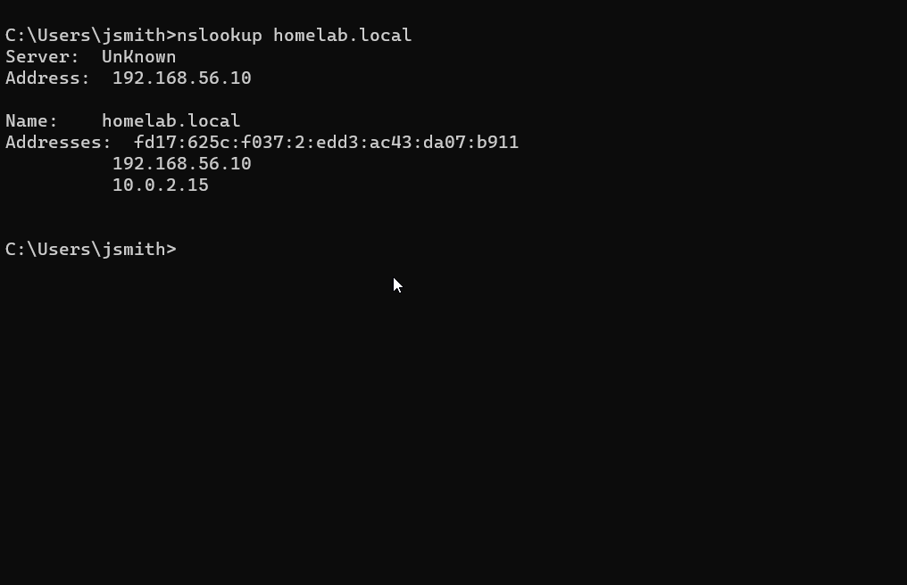

# Domain Join

## Objective

Join a Windows client to an Active Directory domain, allowing it to become part of the domain environment, authenticate using domain user accounts, receive Group Policy settings, and be centrally managed by the Domain Controller.

---

## Prerequisites

Before starting, ensure:

- Windows Server 2022 is installed and running
- Active Directory Domain Services (AD DS) is installed
- A domain has been created (homelab.local)
- DNS is configured on the Domain Controller
- A Windows 11 client virtual machine is installed
- The client and server are connected to the same network
- Network connectivity between the client and server is verified (e.g., ping test)
- A domain user account exists for testing
- Administrator credentials are available

---

## Steps

### Step 1 - Verify Network Connectivity

On the Windows 11 client VM:

Open **Command Prompt**

Run:

```powershell
ping 192.168.56.10
```

**Expected output**

```text
Reply from 192.168.56.10
```
If you receive replies from the server, the client can communicate with the Domain Controller over the network.



**Why?**

Before joining a computer to a domain, it must be able to reach the Domain Controller. If the ping fails, the domain join process will also fail because the client cannot contact Active Directory services.

---

### Step 2 - Verify DNS Resolution

On the Windows 11 client VM:

Open **Command Prompt**

Run:

```powershell
nslookup homelab.local
```

**Expected output**

```text
Server:  Unknown
Address: 192.168.56.10

Name:    homelab.local
Addresses:
          192.168.56.10
```



**Why?**

The client must be able to resolve the domain name to the Domain Controller's IP address. Active Directory relies on DNS to locate domain services during the domain join process.

---

### Step 3. Open System Properties

On the Windows 11 client VM:

Open **Command Prompt**

Run:

```powershell
sysdm.cpl
```

Press **Enter**.


**Why?**

The **System Properties** window allows you to change the computer's membership from a workgroup to an Active Directory domain.


