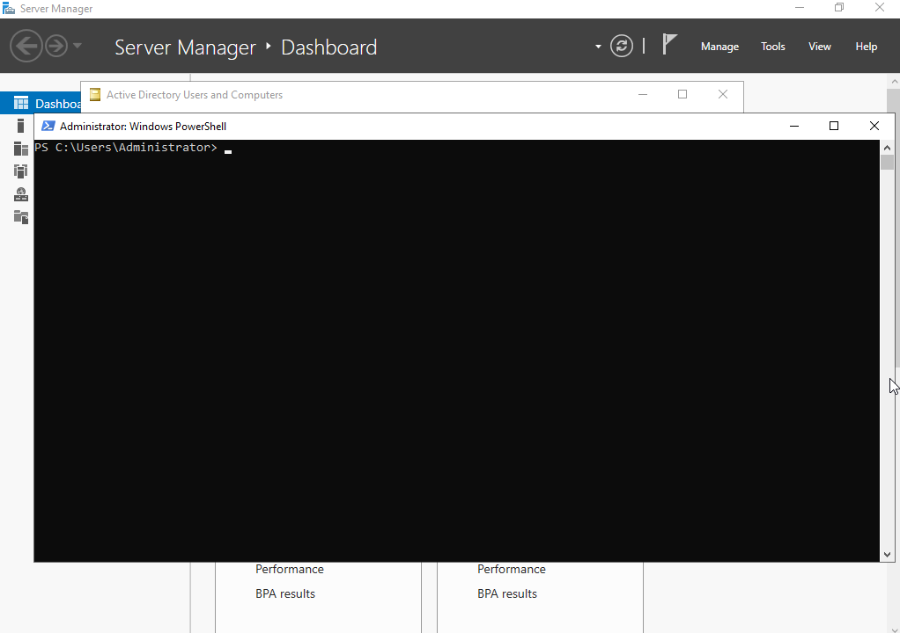
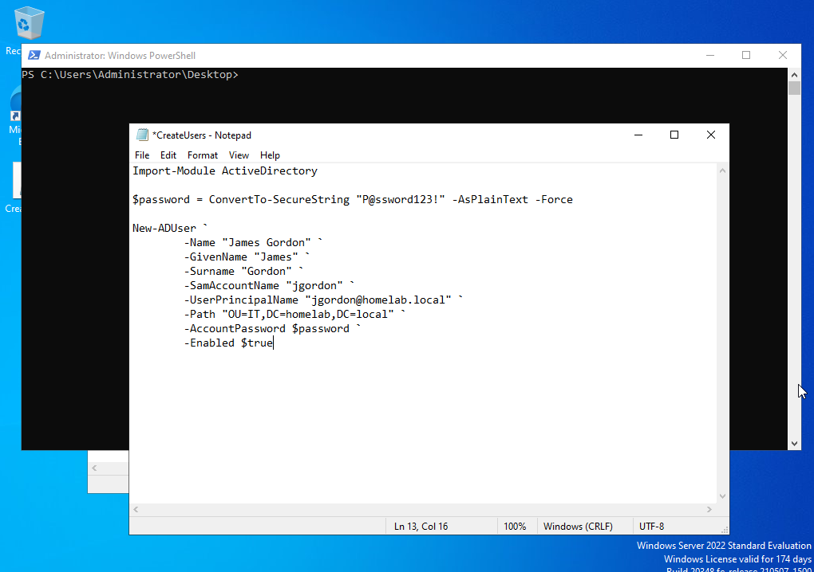

# PowerShell - Create Active Directory Users

## Objective

The objective of this exercise is to automate the creation of Active Directory user accounts using PowerShell. Instead of creating users manually through Active Directory Users and Computers (ADUC), a PowerShell script is used to create user accounts quickly, consistently, and with fewer manual errors.

---

## Prerequisites

Before running this script, ensure the following requirements are met:

- Windows Server 2022 is installed.
- Active Directory Domain Services is configured.
- The server has been promoted to a Domain Controller.
- The required Organizational Units (OUs) (e.g. **IT**, **HR**) have already been created.

Verify the Active Directory module is installed:

```powershell
Get-Module -ListAvailable ActiveDirectory
```

If necessary, allow locally created scripts to run:

```powershell
Set-ExecutionPolicy RemoteSigned
```

---

## Steps 

### 1. Open Windows PowerShell

Open **Windows PowerShell** as **Administrator**.



---

### 2. Create the Script

Create a new PowerShell script named:

```text
CreateUsers.ps1
```

Add the required PowerShell commands to:

- Import the Active Directory module.
- Create a secure password.
- Create one or more Active Directory users.
- Place users into the correct Organizational Unit.
- Enable the accounts.




