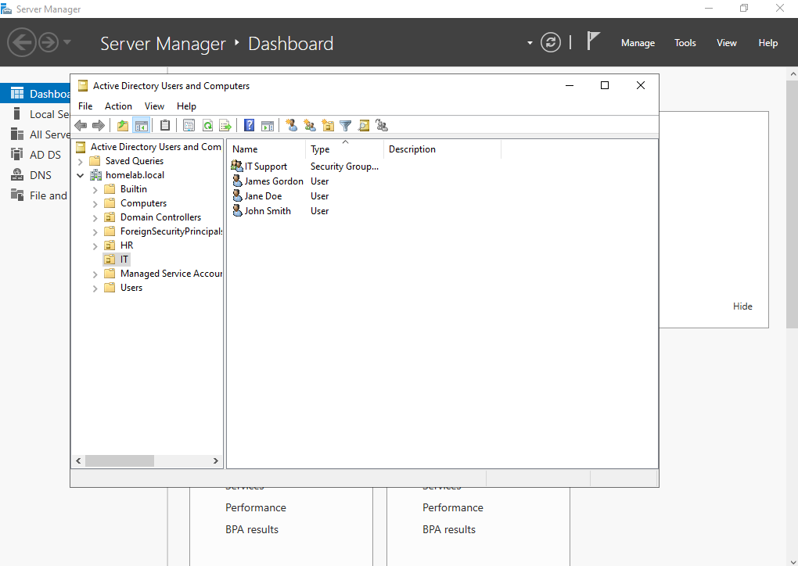
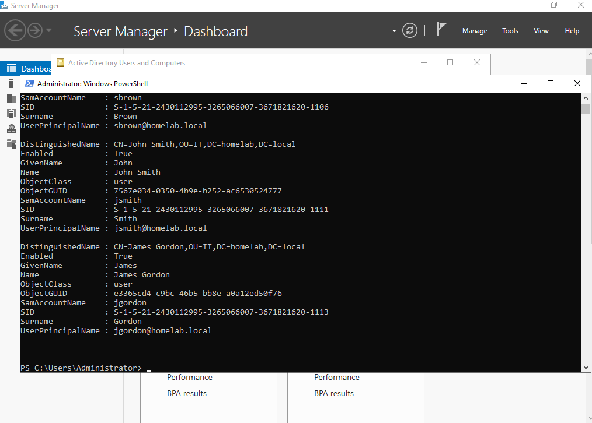

# PowerShell - Create Active Directory Users

## Objective

The objective of this exercise is to automate the creation of Active Directory user accounts using PowerShell. Instead of creating users manually through Active Directory Users and Computers (ADUC), a PowerShell script is used to create user accounts quickly, consistently, and with fewer manual errors.

---

## Prerequisites

Before running this script, ensure the following requirements are met:

- Windows Server 2022 is installed.
- Active Directory Domain Services is configured.
- The server has been promoted to a Domain Controller.
- The required Organizational Units (OUs) (e.g. **IT**, **HR**) have already been created.

Verify the Active Directory module is installed:

```powershell
Get-Module -ListAvailable ActiveDirectory
```

If necessary, allow locally created scripts to run:

```powershell
Set-ExecutionPolicy RemoteSigned
```

This allows locally created PowerShell scripts to run while still requiring downloaded scripts to be digitally signed.

---

## Steps 

### 1. Open Windows PowerShell

Open **Windows PowerShell** as **Administrator**.


**why** 

Running PowerShell as Administrator ensures the script has sufficient permissions to create Active Directory objects.

---

### 2. Create the Script

Create a new PowerShell script named:

```text
CreateUsers.ps1
```

Add the required PowerShell commands to:

- Import the Active Directory module.
- Create a secure password.
- Create one or more Active Directory users.
- Place users into the correct Organizational Unit.
- Enable the accounts.


**note**

Import the Active Directory module so PowerShell can use AD cmdlets such as New-ADUser.

---

### 3. Save the Script

Save the script as:

```text
CreateUsers.ps1
```

---

### 4. Run the Script

Navigate to the script location.

Example:

```powershell
cd Desktop
```

Execute the script:

```powershell
.\CreateUsers.ps1
```

If the script runs without errors, the new user accounts should appear in the specified Organizational Units (OUs) in Active Directory Users and Computers. You can also confirm the accounts using the Get-ADUser cmdlet.



---

## Verification

You can verify using PowerShell:

```powershell
Get-ADUser -Filter *
```

or

```powershell
Get-ADUser gjames
```

Expected result:

DistinguishedName : CN=Gordon James,OU=IT,DC=homelab,DC=local
Enabled           : True
Name              : Gordon James
SamAccountName    : gjames



---

## Script

The complete PowerShell script can be found here:

```text
08-PowerShell/
└── CreateUsers.ps1
```

---

## Key Takeaways

- Used the **ActiveDirectory** PowerShell module to create user accounts.
- Created user accounts faster than using the graphical interface.
- Used secure passwords when creating accounts.
- Verified successful user creation using both Active Directory Users and Computers and PowerShell.


