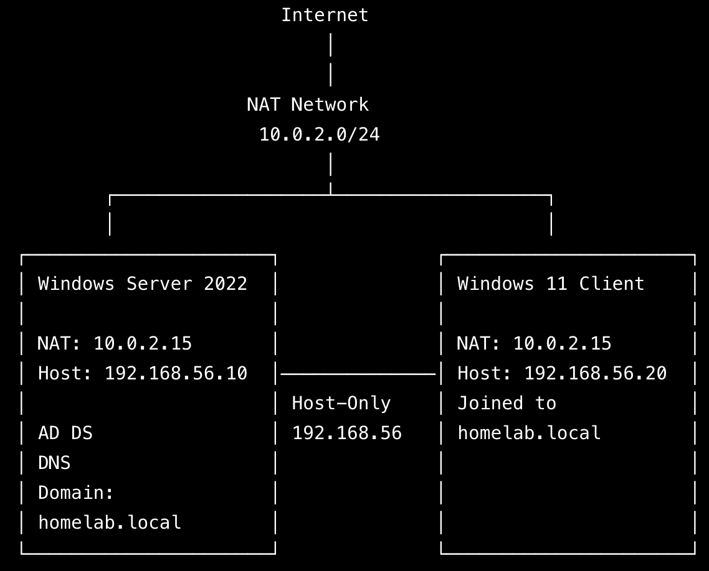
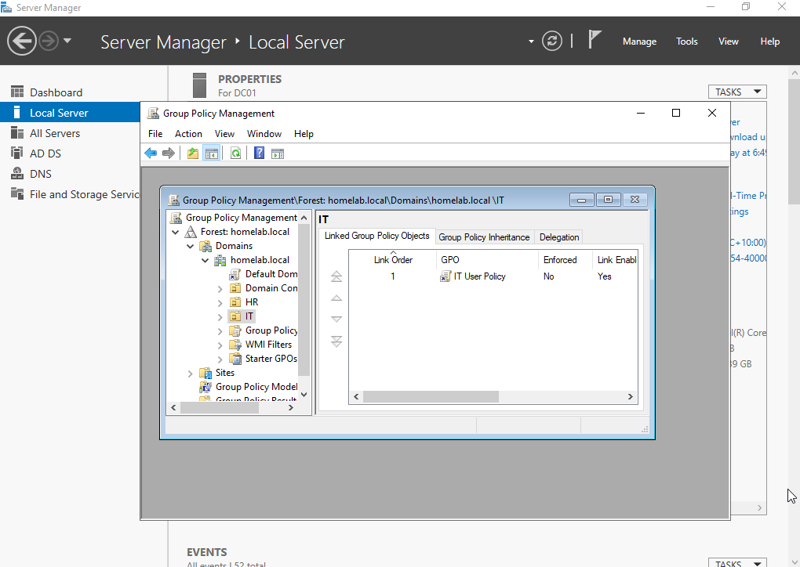

# IT-Home-Lab

**Windows Server 2022 | Active Directory | Group Policy | PowerShell | Windows 11**



## Overview 

This project showcases a Windows Server 2022 home lab built in VirtualBox to demonstrate practical system administration and IT support skills. It covers the deployment and management of an Active Directory domain, user administration, Group Policy, PowerShell automation, and troubleshooting within a virtual lab environment.

---

## Skills Demonstrated

- Windows Server 2022
- Active Directory Domain Services (AD DS)
- DNS Configuration
- User & Group Management
- Group Policy Management
- Windows Client Domain Join
- PowerShell Automation
- Network Troubleshooting
- VirtualBox Virtualization

---

## Lab Environment

| Component | Details |
|----------|---------|
| **Host OS** | macOS |
| **Hypervisor** | VirtualBox |
| **Server** | Windows Server 2022 Standard |
| **Client** | Windows 11 Enterprise |
| **Domain** | `homelab.local` |

---

## Project Structure

```
01-Windows-Server-Installation
02-Active-Directory
03-User-Management
04-Group-Policy
05-Domain-Join
06-Network-Diagram
07-Troubleshooting
08-PowerShell
```

Each section documents the configuration process, verification steps, troubleshooting, and key concepts learned throughout the project.

---

## Project Highlights

### Active Directory

Created an Active Directory domain (`homelab.local`), organizational units, users, and security groups.


---

### Group Policy
Configured and applied Group Policy Objects (GPOs) to centrally manage user settings.



---

### Domain Join
Joined a Windows 11 client to the Active Directory domain and verified successful authentication.


